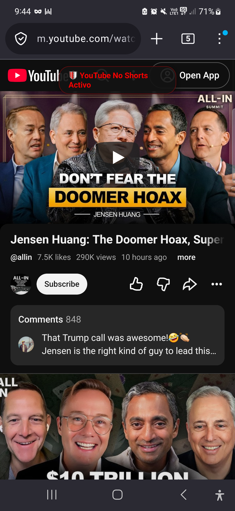
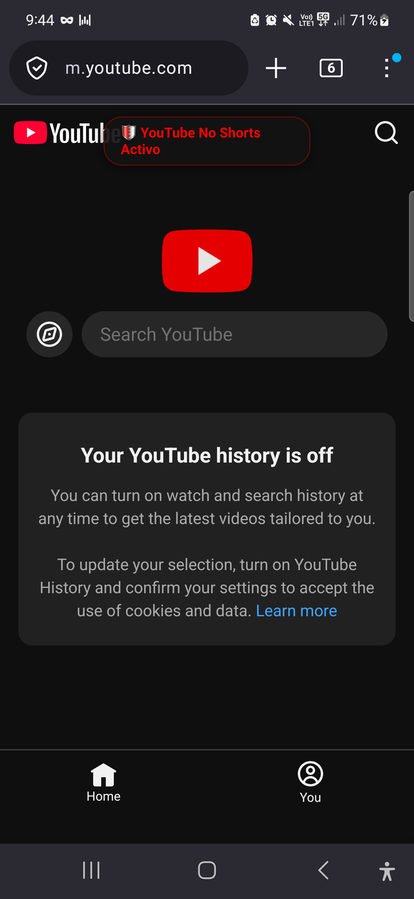
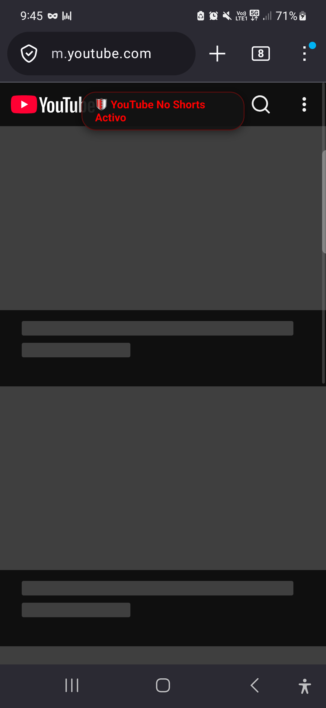

# 🦊 YouTube Focus & Controls (Firefox for Android)

Extensión WebExtension (Manifest V3) para **Firefox en Android**, diseñada para eliminar distracciones en YouTube móvil y reparar los controles multimedia en **Android (Samsung One UI / MediaSession)**. Incluye entorno de desarrollo automatizado con `adb` y firma programática "unlisted" mediante la API de Mozilla Add-ons (AMO).

---

## ✨ Características Principales

### 1. 🚫 Bloqueo Total de YouTube Shorts
- **Pestaña eliminada**: Quita el botón de *Shorts* de la barra inferior de navegación móvil.
- **Carruseles ocultos**: Oculta estanterías y resultados de búsqueda de Shorts con CSS instantáneo (`document_start`, cero parpadeos).
- **Redirección inteligente**: Cualquier enlace directo a `/shorts/<id>` se convierte automáticamente al reproductor clásico `/watch?v=<id>`.

### 2. 🌱 Feed Eradicator (Página Principal)
- Oculta el feed infinito de videos recomendados al entrar a `m.youtube.com`.
- Muestra una tarjeta limpia de **Modo Enfoque** invitándote a buscar conscientemente con la lupa superior en lugar de caer en el algoritmo.

### 3. 👁️ Sin videos sugeridos en el reproductor
- Oculta los videos relacionados debajo del reproductor de video (*Watch page*), evitando que te quedes encadenado viendo videos sin fin.

### 4. 🎵 Corrección de Samsung / Android Media Output
- **Progreso en tiempo real**: Soluciona el problema donde Android siempre mostraba el video en el segundo `0:00`. La barra de reproducción ahora avanza segundo a segundo con la duración total real.
- **Controles habilitados en la cortina de notificaciones y pantalla de bloqueo**:
  - Rebobinar **-10s** (`seekbackward`).
  - Adelantar **+10s** (`seekforward`).
  - Barra de búsqueda interactiva (`seekto`).
  - Siguiente video (`nexttrack`) y video anterior (`previoustrack`).
  - Pausa y reanudación instantánea.
  - Metadatos con título del video, canal y carátula en alta definición.

### 5. 🎛️ Panel de configuración táctil
- Popup accesible desde **Menú `⋮` -> Complementos -> YouTube Focus** con interruptores (*switches*) para activar o desactivar cada función de forma independiente en tiempo real.

---

## 📸 Capturas de Pantalla (Samsung Galaxy S23)

| Confirmación de Inyección | Barra Inferior sin Shorts | Redirección de Enlaces |
| :---: | :---: | :---: |
|  |  |  |

---

## 📁 Estructura del Proyecto

```text
android-extension/
├── Makefile              # Atajos make para dev, build, sign, push, serve, check-device
├── package.json          # Atajos con npm run ...
├── .env.example          # Plantilla para credenciales AMO API
├── README.md             # Documentación del proyecto
├── screenshots/          # Capturas de prueba tomadas desde el dispositivo vía ADB
├── scripts/
│   ├── check-device.sh   # Comprueba conexión ADB y versiones de Firefox en el móvil
│   ├── dev.sh            # Live-reload en Firefox Android sin necesidad de firmar
│   ├── sign.sh           # Firma unlisted programáticamente contra la API de AMO
│   ├── push-xpi.sh       # Envía el .xpi a /sdcard/Download/ vía adb push
│   └── serve-xpi.sh      # Servidor HTTP local para instalación rápida
└── src/
    ├── manifest.json     # Manifiesto MV3 con permisos y Gecko ID
    ├── background.js     # Script de fondo / service worker
    ├── content.css       # Reglas de ocultación de Shorts y Feed Eradicator
    ├── content.js        # Lógica de navegación SPA y observador de mutaciones
    ├── inject.js         # Puente MediaSession inyectado en el contexto de página
    ├── icons/            # Iconos de la extensión (48px y 96px)
    └── popup/            # Interfaz popup táctil con interruptores
```

---

## 🚀 Instalación en tu Celular

### Opción A: Instalación Permanente desde Archivo (Recomendada)
1. En tu celular, abre **Firefox**.
2. Desbloquea el menú de depuración si aún no lo tienes:
   - Ve a `Ajustes` -> `Acerca de Firefox` -> Toca el logo de Firefox **5 veces**.
3. Regresa a `Ajustes` -> Entra en **"Instalar complemento desde archivo"** (*Install add-on from file*).
4. Elige el archivo `youtube-focus-controls.xpi` guardado en tu carpeta de Descargas (*Download*).
5. Pulsa **Añadir**. ¡Quedará instalada permanentemente!

### Opción B: Modo Desarrollo con Cable USB (Live Reload)
```bash
# 1. Comprobar que ADB reconoce tu dispositivo
make check-device

# 2. Iniciar sesión de desarrollo con recarga en caliente
make dev
```

### Opción C: Firma Automática "Unlisted" con AMO API
1. Obtén tus claves en [AMO Developer Hub](https://addons.mozilla.org/es/developers/addon/api/key/).
2. Configura tu `.env`:
   ```bash
   cp .env.example .env
   ```
3. Firma programáticamente:
   ```bash
   make sign
   ```
4. Envía el `.xpi` firmado al teléfono:
   ```bash
   make push
   ```

---

## 🛠️ Comandos Rápidos

```bash
make check-device   # Verifica conexión ADB y Firefox instalados
make lint           # Valida la extensión con web-ext lint (0 errores, 0 avisos)
make build          # Empaqueta la extensión en artifacts/
make dev            # Ejecuta con live-reload en Firefox Android
make sign           # Firma unlisted vía API de Mozilla
make push           # Envía el .xpi a /sdcard/Download/ en el celular
make serve          # Servidor HTTP local con túnel adb reverse
```

---

## 📄 Licencia

MIT © Joseph Mendez (Yoyiberto)
